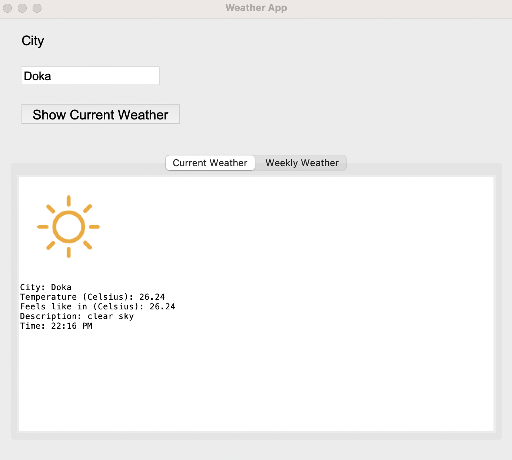

# Weather Application

The goal of this project is to create a weather app that shows the current weather conditions and forecast for a specific location.

## Description

User can enter city name on user interface. According to city name temperature, feels like temperature, time, description
and related icon with the weather status is shown on ui. 




## Getting Started

### Dependencies

* You can find all the libraries and version information used on this project in requirements.txt.

### Installing

* The following command will install the packages according to the configuration file
* $ pip3 install -r requirements.txt

### Executing program

* getweather() function returns response from Open Weather API. For getting weather information by city name I used 
  Built-in API request by city name. When I subscribe open weather map I took an API key in order to retrieve data from this API.
  getweather() function takes city name, user type it to City Entry widget, and returns a response. This response includes
  weather information related to this city.

```
 def getweather(city_name):
    response = requests.get(url.format(city_name, app_id))
    if response:
        res = response.json()
        return res
    else:
        return print('Content not found!!!')
```

* weatherbycity() function responsible extracting needed information from api response. But this button is calling when user 
  clicks  'Show Current Weather' button. I added text1.delete as first command to clear previous results from ui. 
  After getting image and extracting needed data, this function shows all this information in Current Weather tab.
  If user don't enter any city a messagebox shows an error.

```
 def weatherbycity():
     text1.delete('1.0', END)
     resp = getweather(search_city.get())
     if resp:
         temp = resp['main']
         degree = temp['temp']
         feels = temp['feels_like']
         a = resp['weather']
         status = a[0]['description']
         now = datetime.now()
         timestamp = now.strftime('%H:%M %p')
         char = f"\n\nCity: {search_city.get()}\nTemperature (Celsius): {degree}\nFeels like in (Celsius): {feels}\nDescription: {status}\nTime: {timestamp}"
         photo = ImageTk.PhotoImage(get_icon(resp))
         label = Label(image=photo)
         label.pack()
         label.img = photo
         text1.image_create('1.0', image=photo)
         text1.insert(END, chars=char)
     else:
         messagebox.showerror('City cannot found!!!' + search_city.get())
```

* get_icon function is for selecting icons according to Weather condition codes. resp['weather'] is a list of dictionary 
  and includes 'main' key which helps us to understand weather condition. It can be Clouds, Rain, Snow, Clear etc.    
  According to this code using pillow library we can select related png from images folder on the project directory.
  I used the api documentation you can check below link.
  [condition codes link](https://openweathermap.org/weather-conditions#Weather-Condition-Codes-2)


```
 def get_icon(resp):
     mood = resp['weather']
     if mood[0]['main'] == 'Clouds':
         icon = Image.open("images/cloudy.png")
     elif mood[0]['main'] == 'Rain':
         icon = Image.open("images/rainy.png")
     elif mood[0]['main'] == 'Thunderstorm':
         icon = Image.open("images/storms.png")
     elif mood[0]['main'] == 'Snow':
         icon = Image.open("images/snow.png")
     elif mood[0]['main'] == 'Clear':
         icon = Image.open("images/sunny.png")
     else:
         icon = Image.open("images/default.png")
     return icon

```

* The last part is gui part. It is very basic and consist of an entry widget for city entry, a button for showing current
  weather and one notebook which includes two frames(tabs). In this project only Current Weather section is used but as 
  an improvement point we can show weekly weather information on second tab for the further developments. 

```
  search_city = StringVar()
  city = Entry(root, font=('Arial', 16), textvariable=search_city)
  city.pack(anchor="nw", padx=30, pady=5)

  button = Button(root, text='Show Current Weather', font=('Arial', 18), command=weatherbycity)
  button.pack(anchor="nw", padx=30, pady=15)

  notebook = ttk.Notebook(root)
  notebook.pack(pady=15)

  frame1 = ttk.Frame(notebook, width=500, height=130)
  frame2 = ttk.Frame(notebook, width=500, height=130)
  
```


* The mainloop() method puts every item on the display and responds to user input until the program terminates.

  ```
  self.root.mainloop()
  
  ```
